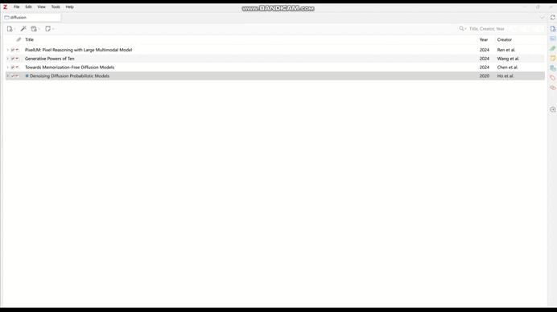
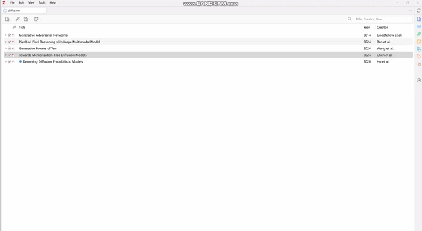

# Set HorizontalScroll

[English](README.md) | [简体中文](README-zhCN.md)

> [!tip]
> 👁 新增覆盖滚动和自动调整缩放大小

# 特性

- ⭐ [New!] 自动设置手型工具
- 当新添加条目时（包含使用Zotero Connector），自动设置View(推荐使用此方式)
- 同时打开"当新添加条目时自动设置"和"每次打开标签页重设", 并不稳定，谨慎使用

## 示例

### 首选项示例

### 首次加入示例

### 打开标签页示例

