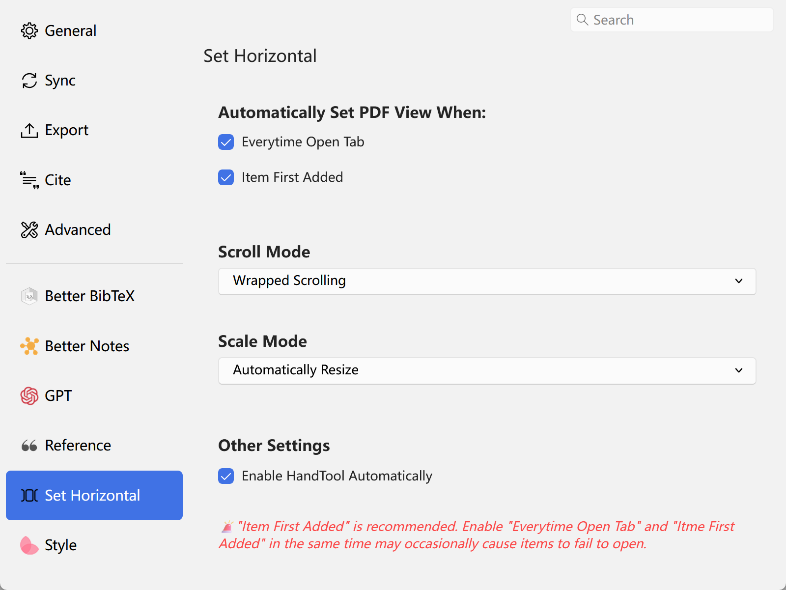
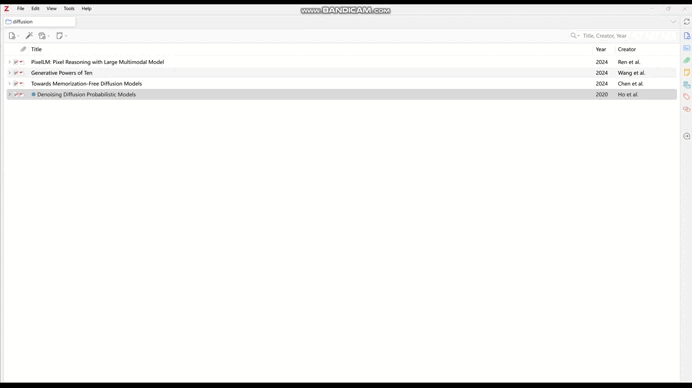
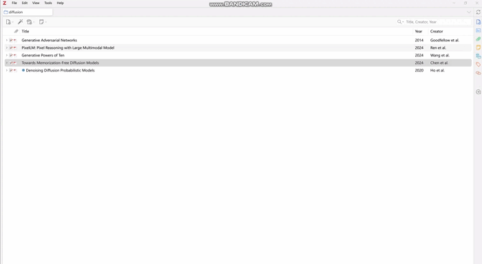

# Set HorizontalScroll

This is a plugin for [Zotero](https://www.zotero.org/).

[English](README.md) | [简体中文](doc/README-zhCN.md)

> [!tip]
> 👁 Add Wrapped Scrolling and Automaticlly Resize.

## Features

- ⭐ [New!] Auto Enable Hand Tool
- Automatically set the View when adding items (Recommended method).

## Examples

### Preference Pane Examples

### Example of Auto Set View When Item First added

### Example of Auto Set View When Open Tab

## Disclaimer

Use this code under AGPL. No warranties are provided. Keep the laws of your locality in mind!
